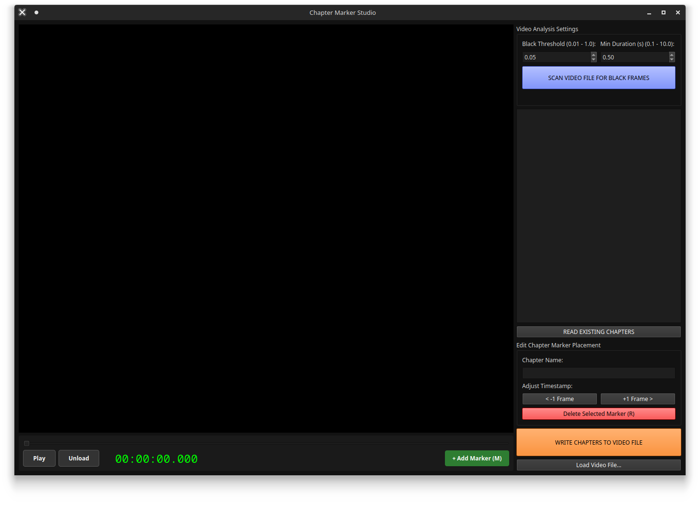

# Chapter Marker Studio

Chapter Marker Studio is a simple Linux GUI for managing video chapter metadata. 

## Features
- Embedded video player for precise marking.
- Add/Remove chapter markers.
- Scan for and edit  existing markers
- Scan for black frames (powered by `mkchap` by Jason Doves).

## Status & License
This project is open source and free to use. It is provided "as-is" without plans for future updates. Feel free to fork and edit the code.

## Prerequisites
- `ffmpeg`
- `ffprobe`

## How to Run
1. Download the `ChapterMarkerStudio` binary from [Releases](../../releases) section.
2. Run `chmod +x ChapterMarkerStudio`.
3. Launch via `./ChapterMarkerStudio`.
